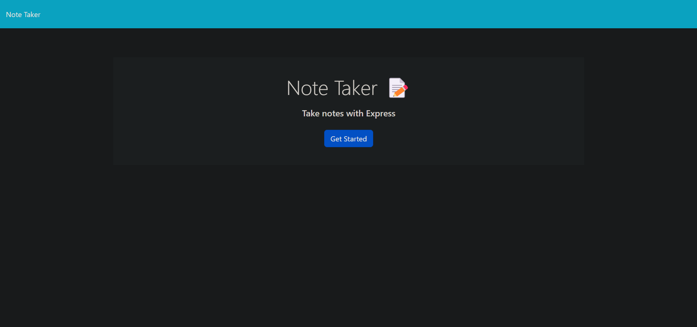
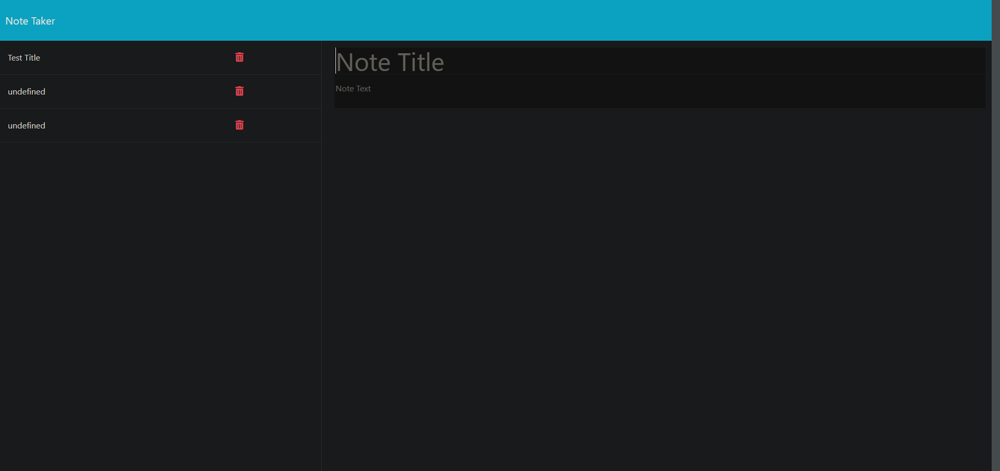
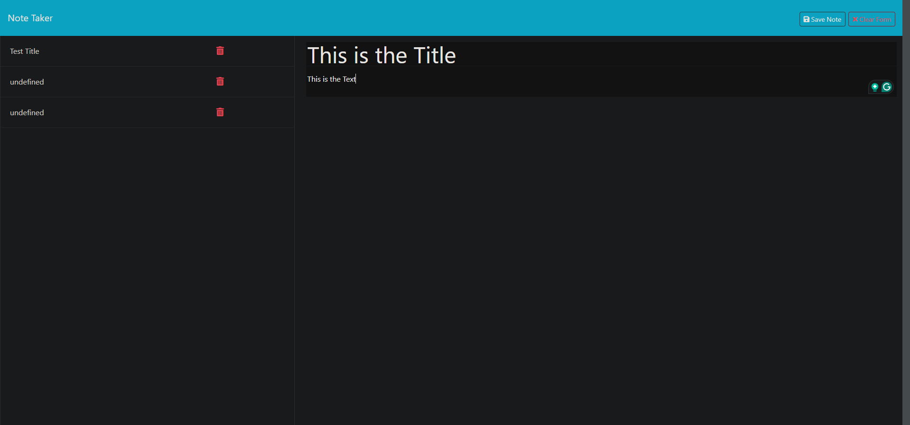
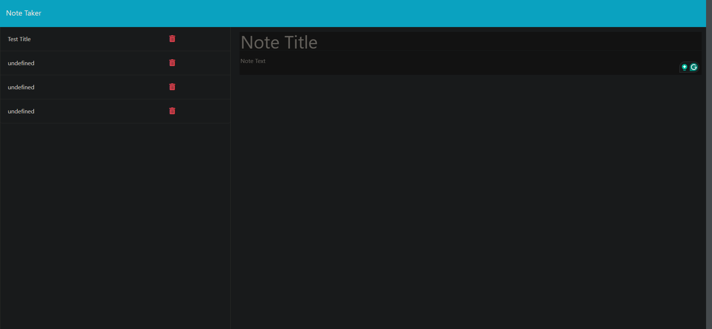

# Note Taker

## Description
This website [website](https://note-taker-ikm1.onrender.com) serves as a note taker for busy individuals that need help managing and organizing their tasks.

## Usage
   
The user is initially greeted with a searchbar requesting the input of a city.

After clicking on search, the page will render icons and data that shows the current forecast, as well as the forecast for the next 5 days.

Underneath the search bar, the user will find a list of recent searched cities that the user will be able to click on see the forecast.

## Credits
none

## License
This project is licensed under the  - see the [MIT License.md](https://opensource.org/licenses/MIT) file for details.

## Questions
Github Username: Jorge-Baldovinos

## Contributors
no

## Tests
no
